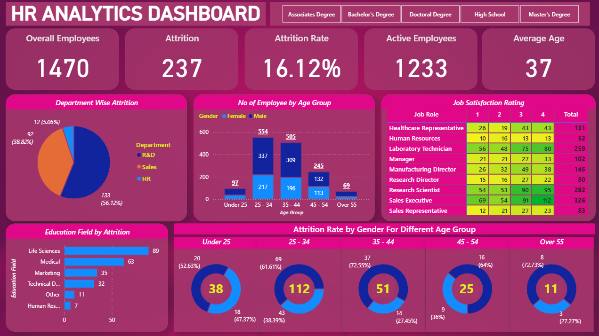

# 📊 HR Analytics Dashboard – Power BI

## 🔍 Project Overview

This project presents an interactive HR Analytics dashboard built using Power BI to analyze employee attrition patterns and workforce insights.

The dashboard helps HR teams identify high-risk attrition segments and understand workforce distribution across departments, age groups, and education fields.

---

## 🚀 Key Features

* KPI cards for Overall Employees, Attrition, Attrition Rate, Active Employees, and Average Age
* Department-wise attrition analysis
* Employee distribution by age group and gender
* Job satisfaction heatmap by role
* Attrition trends across age bands
* Education field impact on attrition

---

## 🛠️ Tools & Technologies

* Power BI
* DAX (Measures & Calculations)
* Data Modeling
* Microsoft Excel

---

## 📸 Dashboard Preview



---

## 🧠 Key DAX Measure Example

```DAX
Attrition Rate = 
DIVIDE([Attrition Count], [Overall Employees])
```

---

## 📂 Dataset

IBM HR Analytics Employee Attrition dataset (sample dataset).

---

## 👤 Author

**Akarsh V**

🔗 Open to Data Analyst / Power BI opportunities
Feel free to connect or reach out!
